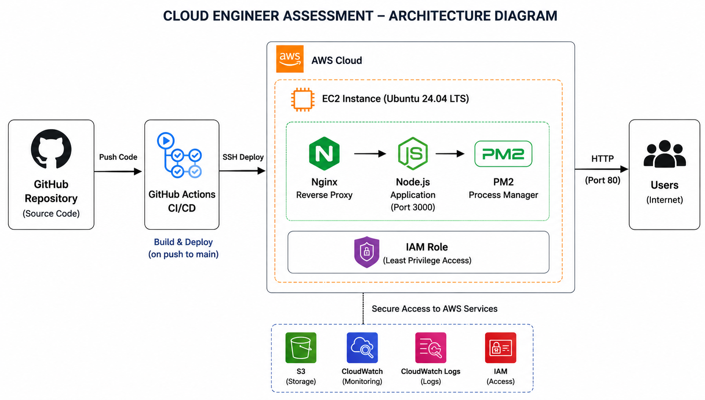
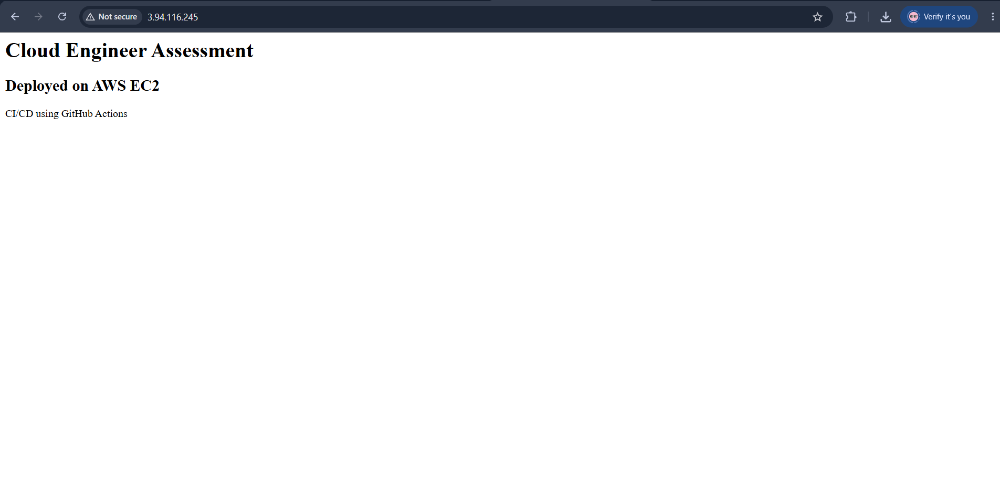
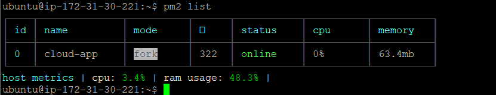
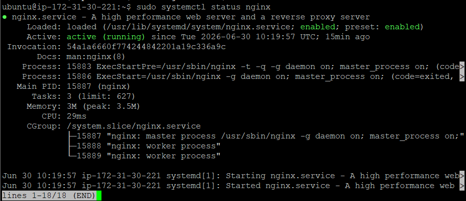
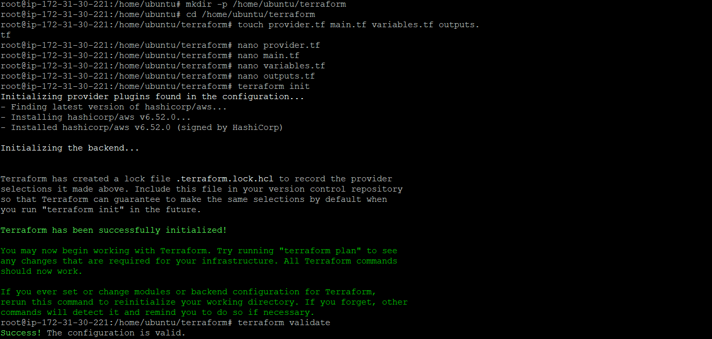
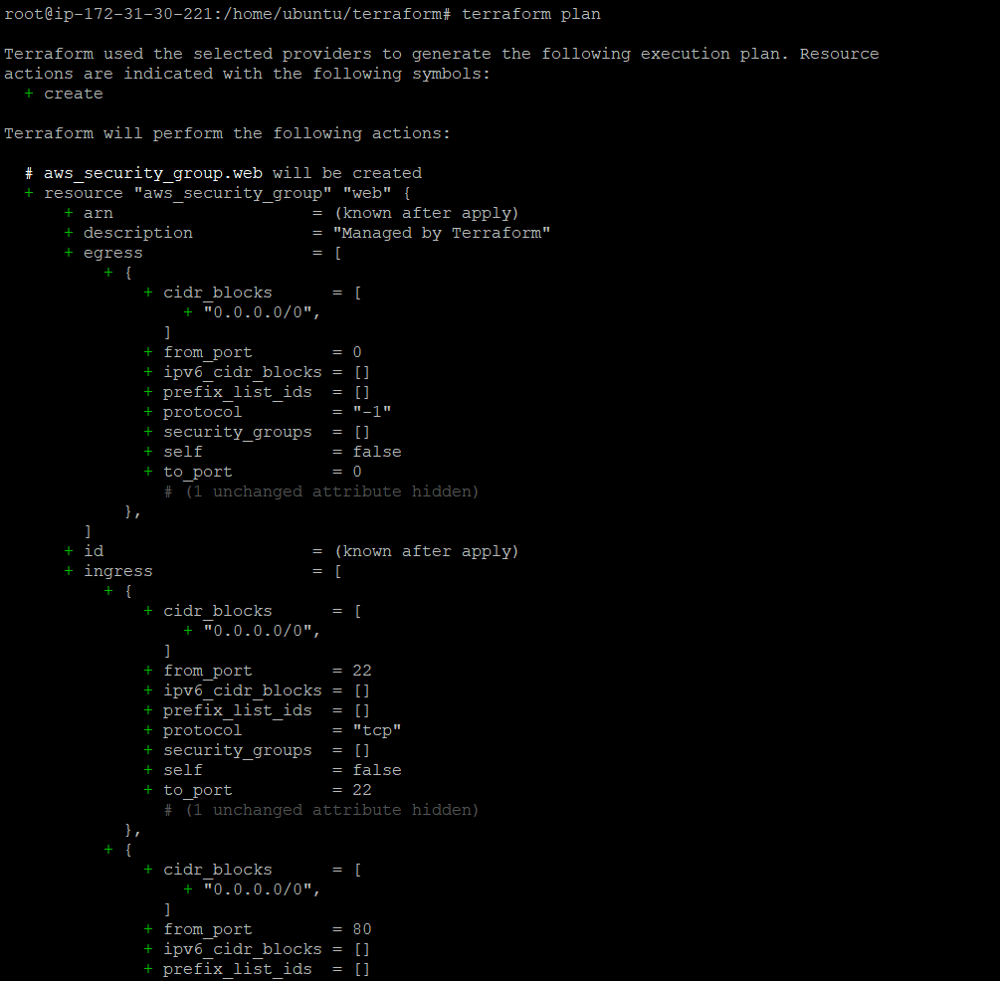
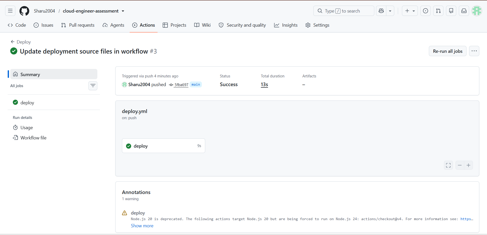

# Cloud Engineer Assessment

## Project Overview

This project demonstrates the deployment of a simple Node.js application on AWS EC2 with CI/CD automation using GitHub Actions. Infrastructure provisioning is managed using Terraform, and the application is publicly accessible over HTTP.

---

## Architecture Diagram



---

## Architecture

```text
GitHub Repository
        |
        | Push Code
        v
GitHub Actions CI/CD
        |
        | Automated Deployment
        v
+------------------------------------------------+
|                 AWS Cloud                      |
|                                                |
| +--------------------------------------------+ |
| | Ubuntu EC2 Instance                       | |
| |--------------------------------------------| |
| | Nginx Reverse Proxy                       | |
| | Node.js Application                       | |
| | PM2 Process Manager                       | |
| | IAM Role Attached                         | |
| +--------------------------------------------| |
|                                                |
+------------------------------------------------+
                     |
                     | HTTP (Port 80)
                     v
                  End Users
```

---

## Technology Stack

- AWS EC2 (Ubuntu 24.04 LTS)
- Node.js
- Express.js
- PM2
- Nginx
- Terraform
- GitHub Actions
- Git
- AWS IAM

---

## Features

- Simple Node.js web application
- Public HTTP access through EC2
- Reverse proxy configuration using Nginx
- Process management using PM2
- CI/CD pipeline using GitHub Actions
- Infrastructure as Code using Terraform

---

## AWS Services Used

| Service | Purpose |
|----------|---------|
| EC2 | Hosts the application |
| IAM | Secure access management |
| Security Group | Controls inbound and outbound traffic |

---

## Project Structure

```text
cloud-engineer-assessment/
│
├── .github/
│   └── workflows/
│       └── deploy.yml
│
├── screenshots/
│   ├── application-running.png
│   ├── browser-output.png
│   ├── github-actions-success.png
│   ├── nginx-status.png
│   ├── pm2-status.png
│   └── terraform-plan.png
│
├── terraform/
│   ├── provider.tf
│   ├── main.tf
│   ├── variables.tf
│   └── outputs.tf
│
├── architecture-diagram.png
├── app.js
├── package.json
├── package-lock.json
├── README.md
└── .gitignore
```

---

## Deployment Steps

### 1. Launch EC2 Instance

- Launch Ubuntu EC2 instance in AWS.
- Configure Security Group:
  - SSH (Port 22)
  - HTTP (Port 80)

### 2. Install Dependencies

```bash
sudo apt update
sudo apt install git -y

curl -fsSL https://deb.nodesource.com/setup_22.x | sudo -E bash -
sudo apt install nodejs -y

sudo npm install -g pm2
sudo apt install nginx -y
```

### 3. Clone Repository

```bash
git clone https://github.com/Sharu2004/cloud-engineer-assessment.git
cd cloud-engineer-assessment
```

### 4. Install Dependencies

```bash
npm install
```

### 5. Start Application

```bash
pm2 start app.js --name cloud-app
pm2 save
```

### 6. Configure Nginx

Create the configuration file:

```bash
sudo nano /etc/nginx/sites-available/cloud-app
```

Add the following configuration:

```nginx
server {
    listen 80;

    server_name _;

    location / {
        proxy_pass http://localhost:3000;
        proxy_http_version 1.1;

        proxy_set_header Upgrade $http_upgrade;
        proxy_set_header Host $host;
        proxy_cache_bypass $http_upgrade;
    }
}
```

Enable Nginx configuration:

```bash
sudo ln -s /etc/nginx/sites-available/cloud-app /etc/nginx/sites-enabled/
sudo nginx -t
sudo systemctl restart nginx
```

---

## Terraform Commands

Initialize Terraform:

```bash
terraform init
```

Validate configuration:

```bash
terraform validate
```

Generate execution plan:

```bash
terraform plan
```

Apply changes:

```bash
terraform apply
```

---

## CI/CD Pipeline

GitHub Actions automatically deploys the application whenever code is pushed to the `main` branch.

### Workflow Steps

1. Checkout source code.
2. Copy application files to EC2.
3. Install dependencies.
4. Restart the application using PM2.

---

## GitHub Secrets

| Secret Name | Description |
|-------------|-------------|
| HOST | EC2 Public IP Address |
| SSH_KEY | EC2 Private Key (.pem contents) |

---

## Design Decisions

- AWS EC2 was selected for its simplicity and flexibility.
- Node.js was chosen for lightweight web application development.
- Nginx was used as a reverse proxy to expose the application on port 80.
- PM2 was selected for process management and automatic restarts.
- GitHub Actions was chosen to automate deployments.

---

## Trade-Offs Considered

| Decision | Trade-Off |
|-----------|-----------|
| Single EC2 Instance | Cost-effective but lacks High Availability |
| No Load Balancer | Simpler architecture but introduces a single point of failure |
| Manual EC2 Provisioning | Faster implementation but less scalable |

---

## Cost Awareness

This project is designed to operate within the AWS Free Tier.

| Resource | Estimated Cost |
|-----------|---------------|
| EC2 t2.micro/t3.micro | Free Tier Eligible |
| IAM | Free |
| Security Groups | Free |
| GitHub Actions | Free Tier Usage |

Estimated monthly cost under Free Tier:

```text
$0 - $5 per month
```

---

---

## Application Screenshots

### Application Running



---

### PM2 Status



---

### Nginx Status



---
### Terraform Init And Validate



### Terraform Plan



---

### GitHub Actions Pipeline



---


## Author

**Sharukeshavalingam A**

